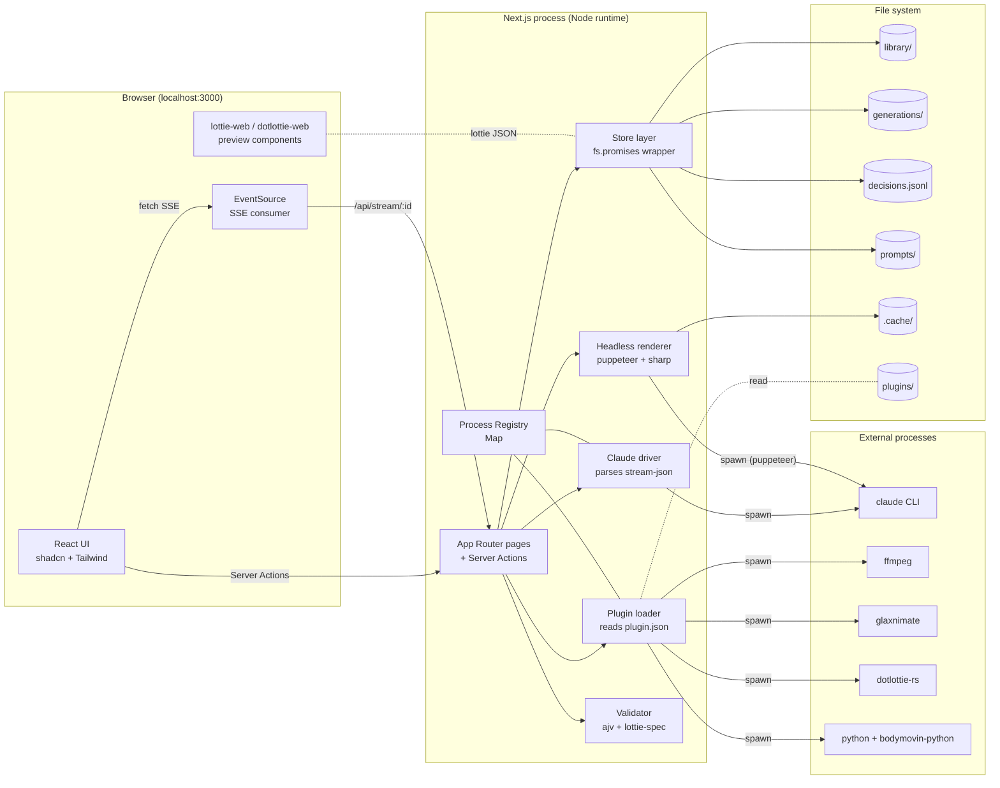
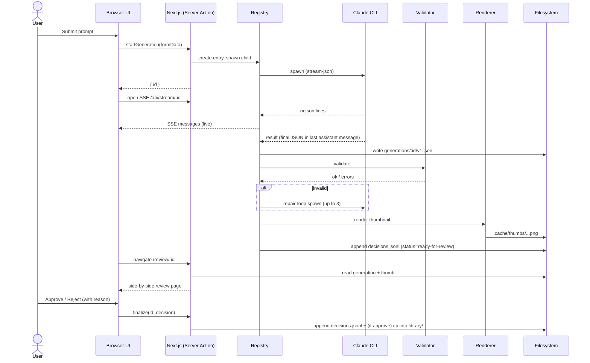

# System architecture

A local-only Next.js app with one process, a file-system backing store, and out-of-process tools invoked via `child_process`.

> **As-shipped in M1:** the diagram below is the design target. Today the Claude driver and data layer are split into workspace packages (`packages/claude-driver/`, `packages/lottie-tools/src/data/`). The plugin loader is **not** yet implemented (M2); plugin manifests under `plugins/` are stubs and the UI hardcodes the available actions per ADR-008. Thumbnail rendering goes through `lottie-web` + `resvg`-on-Node via `apps/admin/lib/thumbnail.ts` — no puppeteer pool. File-watching is not in use; routes are `dynamic = "force-dynamic"` and re-read on each request.

## High-level diagram

## Layers / responsibilities

### Browser (React)

- Renders the UI.
- Hosts `lottie-web` and `dotlottie-web` for previews.
- Subscribes to SSE for live updates while a generation runs.
- Sends form submissions through Server Actions; never talks to external CLIs directly.

### Next.js process

- One Node process serves both the React app and the API.
- **Forces `runtime = "nodejs"`** on every dynamic route so `child_process` and `fs` work.
- Pages are mostly server components; a few clients (preview, scrub bar, prompt form).

### Process registry

- Module-scope (pinned to `globalThis`) `Map<generationId, RunningProcess>`.
- Stores the child process, accumulated ndjson lines, subscribers, status.
- Survives HMR but not full restarts (running children die with the parent).

### Claude driver (`packages/claude-driver/src/`)

- Spawns `claude --print --output-format stream-json --verbose --permission-mode bypassPermissions --disallowed-tools Bash,Edit,Write,Read,Glob,Grep,WebFetch,WebSearch,TodoWrite --append-system-prompt @<system-prompt>`.
- Runs the child in an empty tmp `cwd` so the model never sees the project's `CLAUDE.md`/`docs/`.
- Parses ndjson via `stream-parse.ts`, emits typed events (`init`, `text`, `tool_use`, `result`, `error`, `raw`).
- 60s silence watchdog kills the child if no event arrives; emits a synthetic `error` event.
- Cost/turns/duration land in the final `result` event; `apps/admin/lib/generation.ts` writes them to `decisions.jsonl` and `generations/<id>/meta.json`. A `diagnoseTranscript()` helper classifies empty/rate-limited/tool-narration/no-tag failures into a `kind` field on the decisions row.

### Plugin loader (M2, not in M1)

- Designed as: glob `plugins/*/plugin.json`, validate manifests with zod, expose `runPlugin(id, input, opts)`.
- M1 ships a hardcoded set of actions (optimize, duplicate, export-video, glaxnimate-roundtrip) wired straight into route handlers per ADR-008. Manifest format is real (ADR-007) but unused at runtime.

### Store layer (`packages/lottie-tools/src/data/`)

- All file-system access goes through here. Modules: `atomic.ts` (write-tmp-then-rename + jsonl append), `library.ts`, `generations.ts`, `decisions.ts`, `promote.ts`, `types.ts`, `index.ts`.
- Read paths re-scan on each request (routes are `dynamic = "force-dynamic"`); no in-memory cache, no chokidar.
- No DB. Files are the source of truth.

### Renderer / thumbnails (`apps/admin/lib/thumbnail.ts`)

- `lottie-web` → SVG → `@resvg/resvg-js` → PNG; runs in the Node runtime per route.
- Cached under `.cache/thumbs/<contentHash>.png` (lazily, on first GET of `/api/library/[id]/thumb`).
- No puppeteer pool today.

### Validator (`packages/lottie-tools/src/validator/`)

- ajv-compiled `lottie-spec` JSON Schema.
- Plus a few custom lints (expressions present, text layers, broken refs).

## Data flow — generation cycle

## Concurrency model

- **One Node process.** No worker threads in v1; the registry handles parallelism by capping concurrent children (default 5; see `.config/settings.json`'s `concurrent_generations`).
- Claude CLI invocations are independent processes; OS schedules them.
- Renderer pool: 1–2 puppeteer instances reused across requests.
- Plugin runs are serialized per plugin id (some plugins write to shared resources like Glaxnimate's project files).

## Failure modes & recovery

| Failure | Detection | Recovery |
|---|---|---|
| Claude CLI not on PATH | `which claude` at boot | Settings page shows install hint. Generate button disabled. |
| Claude CLI hangs | wall-clock timeout | Kill child, mark generation as failed, surface in UI. |
| Generated JSON fails validation | ajv errors | Repair loop (up to 3). If still failing, queue with `failed-validation` status. |
| Generated JSON renders blank | renderer pixel-check | Mark `failed-render`; user can still inspect raw JSON. |
| Plugin missing dep | manifest `requires` check | Plugin button disabled with tooltip. |
| Filesystem write fails | try/catch in store | Toast + log; no partial writes (write to tmp + rename). |
| Server restart mid-generation | startup reconciler | Mark in-flight as `cancelled`; user can retry. |

## Why no database

- File-system is git-friendly (Sam wants this).
- No migration story (Aria wants this).
- Reduces dependency surface (Devon wants this).
- The data model is small (≤ a few thousand items per library); a DB would be overkill.
- Future: if needed, add a SQLite cache for fast search; canonical data stays as files.
