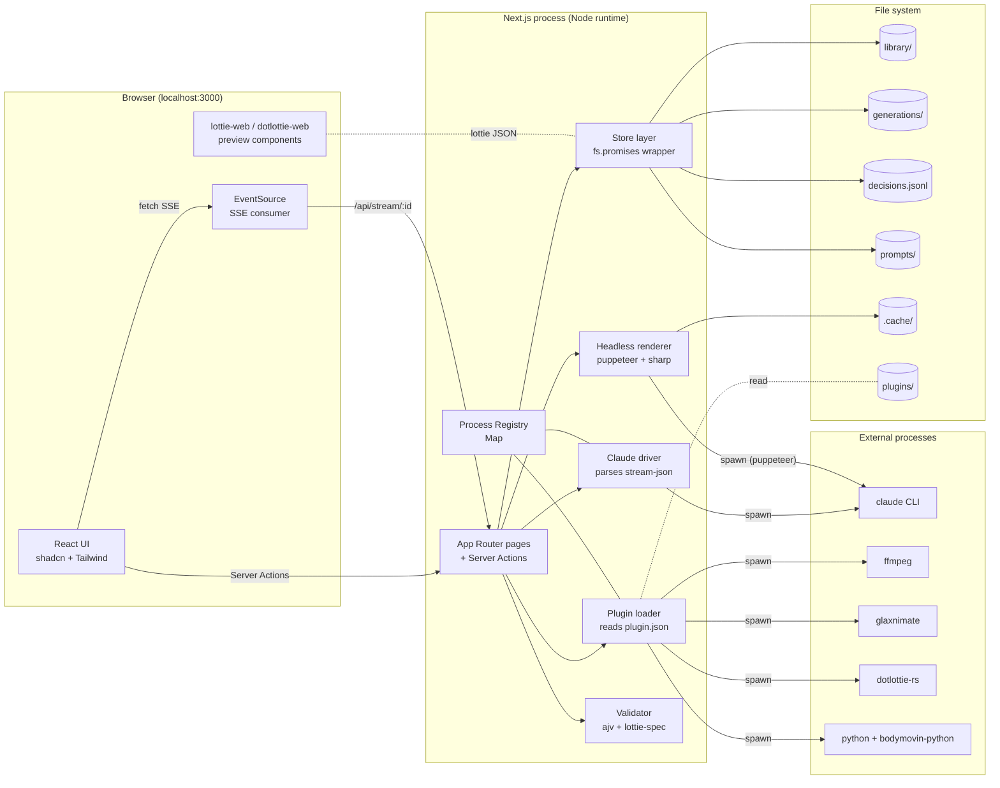
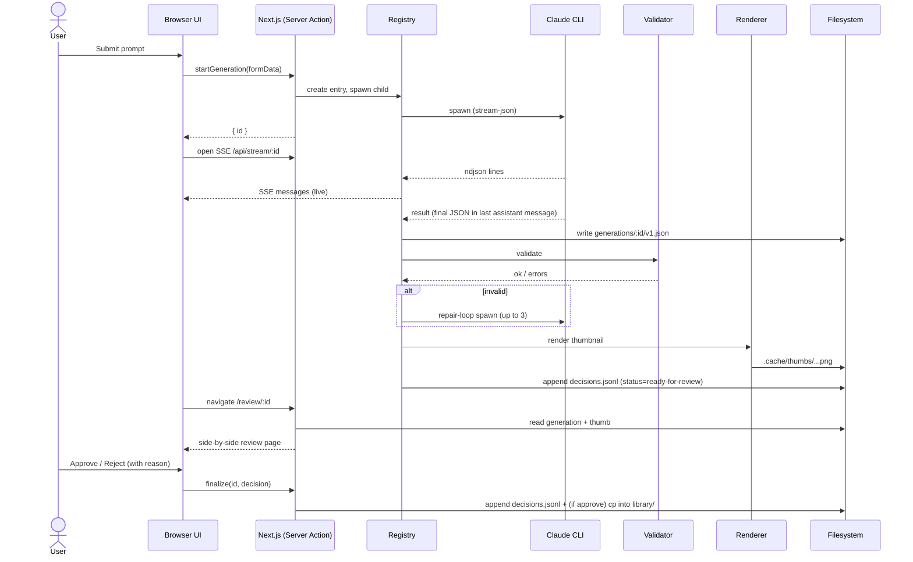

# System architecture

A local-only Next.js app with one process, a file-system backing store, and out-of-process tools invoked via `child_process`.

## High-level diagram

## Layers / responsibilities

### Browser (React)

- Renders the UI.
- Hosts `lottie-web` and `dotlottie-web` for previews.
- Subscribes to SSE for live updates while a generation runs.
- Sends form submissions through Server Actions; never talks to external CLIs directly.

### Next.js process

- One Node process serves both the React app and the API.
- **Forces `runtime = "nodejs"`** on every dynamic route so `child_process` and `fs` work.
- Pages are mostly server components; a few clients (preview, scrub bar, prompt form).

### Process registry

- Module-scope (pinned to `globalThis`) `Map<generationId, RunningProcess>`.
- Stores the child process, accumulated ndjson lines, subscribers, status.
- Survives HMR but not full restarts (running children die with the parent).

### Claude driver (`lib/claude/`)

- Spawns `claude -p ... --output-format stream-json --verbose ...`.
- Parses ndjson, dispatches typed events (`onSystem`, `onAssistantDelta`, `onToolUse`, `onResult`).
- Tracks cost and tokens; writes to `decisions.jsonl` on completion.

### Plugin loader (`lib/plugins/`)

- On boot, globs `plugins/*/plugin.json`, validates each manifest with zod.
- Exposes `runPlugin(id, input, opts)` which spawns the plugin's declared command, pipes Lottie JSON in, captures output, validates, returns.
- UI renders plugin buttons on the relevant pages based on each manifest's `surfaces` field.

### Store layer (`lib/store/`)

- All file-system access goes through here.
- Functions: `listLibrary`, `getItem(id)`, `writeGeneration(id, json)`, `appendDecision(d)`, etc.
- Uses `chokidar` to watch `library/` and `generations/` and revalidate Next caches.
- No DB. Files are the source of truth.

### Headless renderer (`lib/lottie/render.ts`)

- Wraps `puppeteer-lottie` (heavy) and `lottie-web → resvg` SVG path (light).
- Caches frames under `.cache/thumbs/{contentHash}/`.

### Validator (`lib/lottie/validate.ts`)

- ajv-compiled `lottie-spec` JSON Schema.
- Plus a few custom lints (expressions present, text layers, broken refs).

## Data flow — generation cycle

## Concurrency model

- **One Node process.** No worker threads in v1; the registry handles parallelism by capping concurrent children (default 3).
- Claude CLI invocations are independent processes; OS schedules them.
- Renderer pool: 1–2 puppeteer instances reused across requests.
- Plugin runs are serialized per plugin id (some plugins write to shared resources like Glaxnimate's project files).

## Failure modes & recovery

| Failure | Detection | Recovery |
|---|---|---|
| Claude CLI not on PATH | `which claude` at boot | Settings page shows install hint. Generate button disabled. |
| Claude CLI hangs | wall-clock timeout | Kill child, mark generation as failed, surface in UI. |
| Generated JSON fails validation | ajv errors | Repair loop (up to 3). If still failing, queue with `failed-validation` status. |
| Generated JSON renders blank | renderer pixel-check | Mark `failed-render`; user can still inspect raw JSON. |
| Plugin missing dep | manifest `requires` check | Plugin button disabled with tooltip. |
| Filesystem write fails | try/catch in store | Toast + log; no partial writes (write to tmp + rename). |
| Server restart mid-generation | startup reconciler | Mark in-flight as `cancelled`; user can retry. |

## Why no database

- File-system is git-friendly (Sam wants this).
- No migration story (Aria wants this).
- Reduces dependency surface (Devon wants this).
- The data model is small (≤ a few thousand items per library); a DB would be overkill.
- Future: if needed, add a SQLite cache for fast search; canonical data stays as files.
